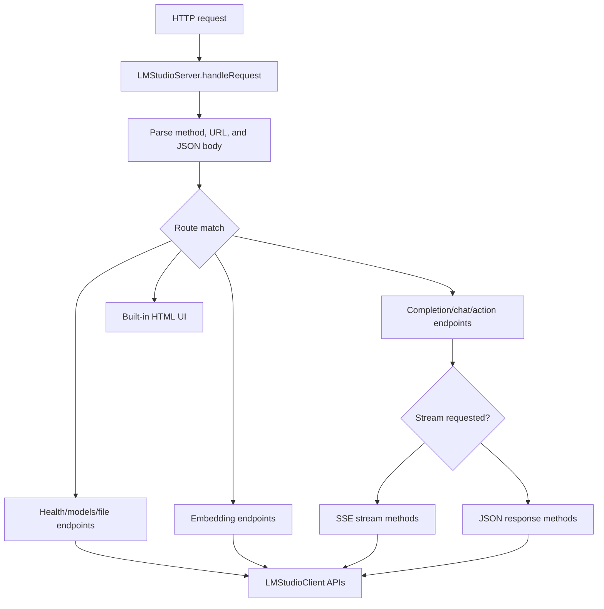
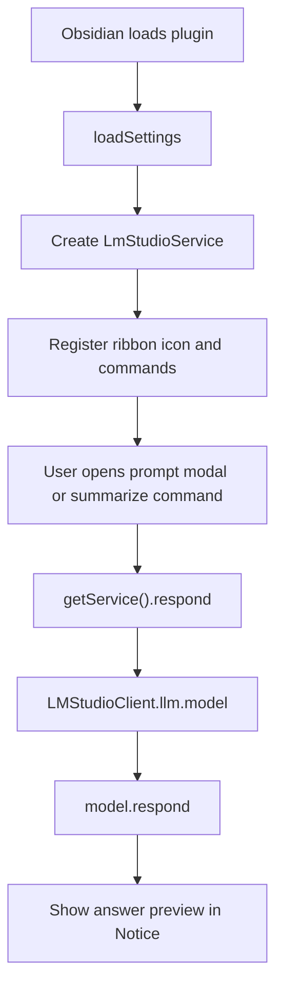

# Architecture Deep Dive

## Repository Layout

```text
C:\X-DEV-Open-Mind
|-- package.json
|-- build-help.js
|-- install-and-build.ps1
|-- install-and-build.sh
|-- X-DEV-LM-Studio
|   |-- package.json
|   |-- tsconfig.json
|   |-- src
|   |   |-- index.ts
|   |   |-- settingsIntegration.ts
|   |   |-- settingsUI.tsx
|   |   |-- settingsUI.test.ts
|   |   |-- app.tsx
|   |   |-- app.css
|   |   |-- settingsUI.css
|   |-- README.md
|   |-- SETTINGS_UI_README.md
|-- X-DEV-Obsidian
|   |-- package.json
|   |-- tsconfig.json
|   |-- esbuild.config.mjs
|   |-- manifest.json
|   |-- versions.json
|   |-- src
|   |   |-- main.ts
|   |-- README.md
```

## Workspace Role

The root `package.json` defines two npm workspaces:

- `X-DEV-LM-Studio`
- `X-DEV-Obsidian`

Root scripts call workspace scripts for install, build, dev, and start. `build:all` and `dev:all` use `concurrently`, which must be installed at the root before those scripts work.

## LM Studio Backend

Primary file: `X-DEV-LM-Studio/src/index.ts`

The backend wraps `@lmstudio/sdk` behind a Node HTTP server. It exposes:

- Health routes.
- Model listing/loading/unloading.
- Text completion and chat response routes.
- Tool-calling route through `model.act`.
- Embedding routes.
- File preparation, image preparation, document parsing, and retrieval routes.
- Server-sent event streaming for completions, chat, and act workflows.
- A simple built-in HTML UI at `/`.

### Runtime Flow



### Integration Boundary

The backend connects to LM Studio using a normalized websocket base URL. HTTP URLs are converted:

- `http://host:port` becomes `ws://host:port`
- `https://host:port` becomes `wss://host:port`
- Raw host values are prefixed with `ws://`

## LM Studio React Settings Tester

Primary files:

- `X-DEV-LM-Studio/src/settingsUI.tsx`
- `X-DEV-LM-Studio/src/app.tsx`
- `X-DEV-LM-Studio/src/settingsIntegration.ts`
- `X-DEV-LM-Studio/src/settingsUI.test.ts`

This appears to be a prototype/test UI for configuring LM Studio settings. It is not currently wired into the Node backend build or served by the backend. The backend serves its own inline HTML UI from `getUiHtml()` in `index.ts`.

Important architectural mismatch:

- `tsconfig.json` is configured for a Node/CommonJS backend with `lib: ["ES2020"]`.
- React/TSX files need React dependencies, JSX compiler settings, and DOM libs.
- Because all `src/**/*` files are included, the backend build tries to compile the React UI and fails.

## Obsidian Plugin

Primary file: `X-DEV-Obsidian/src/main.ts`

The plugin connects directly to LM Studio through `@lmstudio/sdk`, not through the local HTTP backend. It provides:

- Ribbon icon: "Ask LM Studio".
- Command: connect to LM Studio.
- Command: ask LM Studio through a modal.
- Command: summarize the active markdown note.
- Settings tab for connection and generation options.

### Runtime Flow



## Build System

The root helper scripts are:

- `build-help.js` - prints command reference.
- `install-and-build.ps1` - Windows installer/builder.
- `install-and-build.sh` - Bash installer/builder.

PowerShell script behavior:

- Installs missing project dependencies.
- Delegates builds to root npm workspace scripts.
- Supports `-watch`, `-start`, and `-project`.

Bash script behavior:

- Installs missing project dependencies.
- Builds selected projects directly and in parallel.
- Supports `--watch`, `--start`, and `--project`.

Minor difference:

- The PowerShell script uses root workspace scripts for builds.
- The Bash script uses direct per-project build functions.
